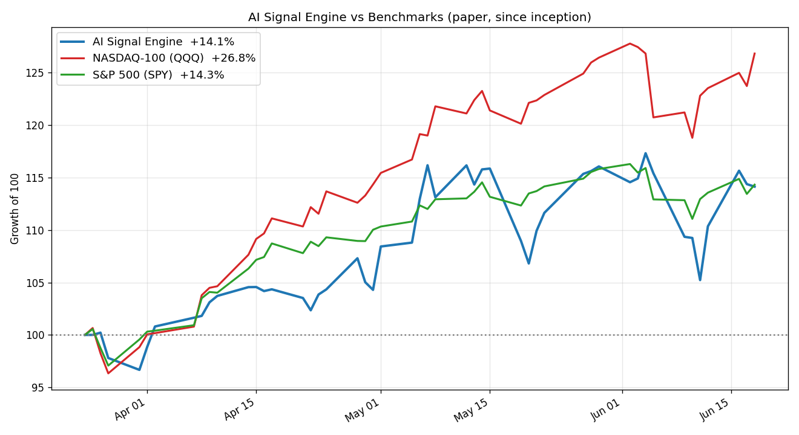
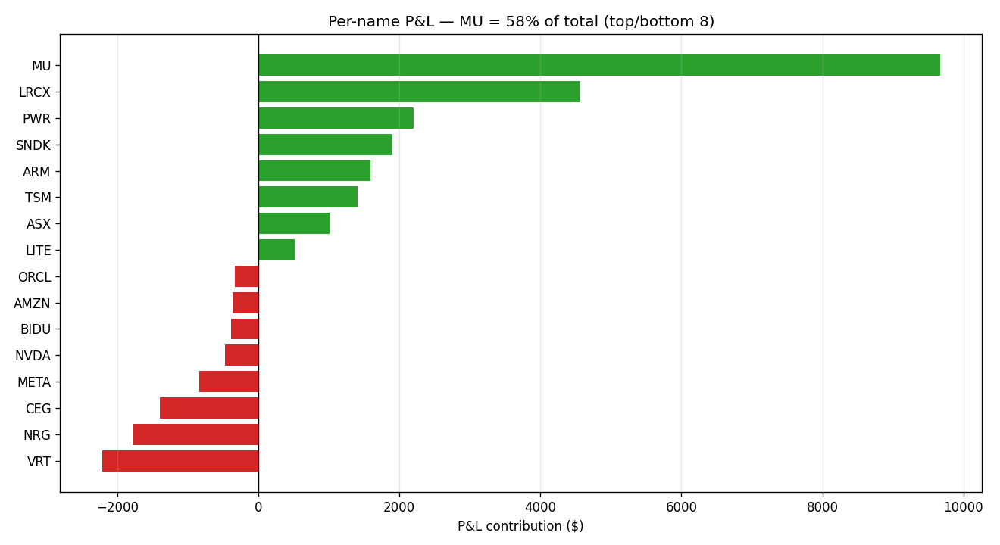
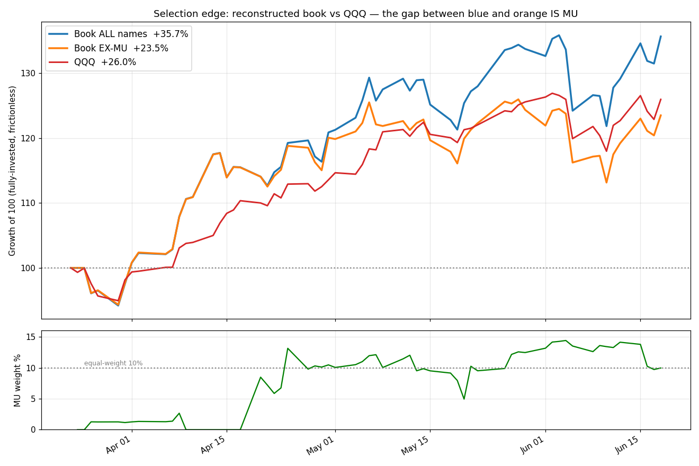

# AI Signal Engine v1 — Performance & Retirement Report

**Date:** 2026-06-20
**Status:** 🔴 Retired (replaced by the five-layer "layer-cake" engine)
**Track record:** Mar 25 – Jun 19 2026 (~87 days, Alpaca paper)

---

## 1. Executive summary

The v1 engine was a long-only AI-infrastructure equity strategy: it ingested research,
asked **Gemini** to produce a conviction-weighted 10-stock portfolio, scaled exposure with a
macro regime model, and executed on Alpaca paper.

**Headline result: +16.66% since inception** (equity $100,000 → **$116,659**).

That number looks good against the broad market but **does not survive scrutiny**:

- It **beat the S&P 500** (+16.6% vs +14%, but with ~2× the volatility) and **lost badly to
  the NASDAQ-100** (+27%), which is its true benchmark.
- **58% of all profit came from a single position (MU)** that the model held at *below*
  equal weight — i.e. luck, not a sized conviction call.
- Stripped of MU, the strategy's stock selection **had no measurable edge** over a passive
  QQQ hold, and the Gemini conviction scores carried **zero predictive information**.
- On a risk-adjusted basis it was the **worst of the three** (Sharpe 2.10 vs SPY 4.34, QQQ 5.32).

It is being retired because the data shows the LLM stock-picker added no repeatable alpha.
The successor keeps the AI-infra thesis but confines the LLM to bounded value-chain layer
tilts and selects names mechanically (momentum), which backtests materially better.

---

## 2. How it worked

```
Ingest (RSS / HF daily papers / SEC EDGAR)
        │
        ▼
Gemini scorer  ──►  conviction-weighted 10-stock long portfolio (weights + conviction 0-1)
        │
Macro regime model  ──►  net-exposure target (0.64–0.80), regime label
        │
        ▼
Alpaca paper execution  ──►  daily full rebalance toward target weights × net exposure
```

- **Ingestion:** ~7 RSS feeds (SemiAnalysis, Stratechery, Latent Space, etc.), HuggingFace
  daily papers, and SEC 8-K filings for the mega-caps. ~1,490 documents over the run.
- **Scoring:** a single Gemini call returned a full portfolio — tickers, weights (max 10%
  each, summing to 1.0), and a 0–1 conviction per name — plus a regime label and thesis
  narrative. Semantic retrieval (ChromaDB) fed it the most-relevant prior research.
- **Macro overlay:** a quant module set a net-exposure target from PMI, credit stress, VIX,
  and cross-sector leads; the book ran **64–80% net long**, never fully invested.
- **Execution:** a daily launchd job rebalanced the whole book toward the new weights.

---

## 3. Performance vs benchmarks

Over the comparison window (Mar 24 – Jun 18, daily mark-to-market):

| | Total return | Annualized vol | Sharpe (rf=0) | Max drawdown |
|---|---|---|---|---|
| **AI Signal Engine** | **+14.1%** | **36.1%** | **2.10** | **−10.3%** |
| S&P 500 (SPY) | +14.3% | 16.5% | 4.34 | −4.5% |
| NASDAQ-100 (QQQ) | +26.8% | 24.0% | 5.32 | −7.0% |

*(The +16.66% headline is the account equity through Jun 19; +14.1% is the daily-marked
figure over the exact benchmark window — same story, minor basis difference.)*



**Read:** the engine tracked the S&P almost exactly but with **2.2× the volatility** and
**2.3× the drawdown**, and it never kept pace with the NASDAQ. It matched broad-market
*returns* while carrying concentrated-tech *risk* — the worst trade-off of the three.

---

## 4. Attribution — the result was one lucky name

580 fills, ~$1.42M gross traded notional (**14.2× turnover** on $100k), 42 distinct names.

| Metric | Value |
|---|---|
| Total P&L | +$16,660 |
| **MU contribution** | **+$9,669 (58% of all profit)** |
| Hit rate | 22/42 names profitable (**52%** — a coin flip) |
| Top winners | MU +9,669 · LRCX +4,565 · PWR +2,207 · SNDK +1,903 · ARM +1,591 |
| Worst losers | VRT −2,218 · NRG −1,788 · CEG −1,400 · META −833 · NVDA −471 |



**Strip out MU and the engine returned ~+7%** — roughly half the S&P and a quarter of the
NASDAQ. The mega-caps that *drove* the NASDAQ's +27% (NVDA, META, AMZN, AVGO) were **owned
but churned into roughly zero or a loss** — the engine identified the right universe but
extracted almost nothing from it, while over-trading the laggards (NRG: 39 fills, −$1,788).

---

## 5. Did the scorer have edge? No.

Reconstructing the full daily book (fully invested, frictionless — the scorer's *best case*):

| Book | Return | vs QQQ |
|---|---|---|
| All names | +35.7% | +9.7 pts |
| **Ex-MU** | **+23.5%** | **−2.5 pts** |
| QQQ | +26.0% | — |



- The entire "edge" over QQQ **is MU** — and **MU was held at avg 7.9% weight, *below* the
  10% equal-weight baseline** (chart, lower panel). The model never sized into its big
  winner. That is a lottery ticket it happened to own, not a conviction call.
- Ex-MU, the book closet-tracks QQQ (correlation 0.74, daily win rate 49%) and finishes
  **behind** it.
- **Conviction scores are noise:** rank IC of conviction vs forward return ≈ **−0.008**
  over 125 name-period observations; the top-conviction tercile did *worse* than the bottom.

Three independent cuts (full-period reconstruction, a May–Jun signal-weight backtest, and
the conviction IC) all agree: **no demonstrable stock-selection alpha.**

---

## 5a. Overlap with the benchmarks

How much of the engine was just "the AI-infra slice of the index"?

- **Reliable measure (reconstructed book, ex-MU, daily):** correlation to QQQ **0.74**, daily
  win rate **49%**. The strategy *was* QQQ's AI-infra names, tracked closely and slightly
  worse — a closet index with extra turnover, not a differentiated book.
- **Live-equity-series measure (unreliable):** the Alpaca paper daily-equity returns show
  near-zero correlation/beta to both benchmarks — **S&P 500: corr 0.15, β 0.34, R² 0.02** and
  **NASDAQ-100: corr 0.05, β 0.08, R² 0.00**. These are implausibly low for an AI-infra book
  (which cannot truly be uncorrelated to the NASDAQ) and are an artifact of noisy daily marks
  in the paper feed. **Any CAPM "alpha" derived from this ~0 beta is meaningless and is not
  reported here** — the reconstructed 0.74 figure is the honest overlap.

## 5b. Ablations summary

Every independent test we ran points the same way — no selection edge once MU is removed:

| Ablation | Method | Result |
|---|---|---|
| Full-period reconstruction | Daily holdings × prices, fully invested, frictionless | All +35.7% / **ex-MU +23.5%** vs QQQ +26.0% → ex-MU **−2.5 pts** |
| Signal-weight backtest (May–Jun) | Hold each signal's basket to next signal | With-MU −1.2 pts vs QQQ (25% period win); **ex-MU −4.3 pts** (33% win) |
| Conviction information coefficient | Spearman rank IC, conviction vs forward return, 125 obs | **IC ≈ −0.008**; top-conviction tercile did *worse* than bottom |
| MU sizing | Avg portfolio weight of the one big winner | **7.9%** — *below* the 10% equal-weight baseline → luck, not a sized call |
| Benchmark overlap | Daily correlation, reconstructed ex-MU book | **0.74 to QQQ** — closet-indexed the NASDAQ's AI names |

The convergence of these — different windows, different methods — is why the conclusion is
held with confidence despite the short track record.

## 6. Operational issues observed

- **Double-firing:** a launchd job and an execution cron both submitted full rebalances
  (Jun 19: 24 colliding orders).
- **Silent unfilled orders:** the Jun 19 rebalance sat in `accepted`/unfilled; the book was
  effectively frozen for days while logs reported "Rebalance complete."
- **Lost logs:** some runs left no trace, making failures invisible without querying Alpaca.
- **Gemini credit outage (Jun 9–12):** 272× `429 RESOURCE_EXHAUSTED`; scoring degraded to
  fallback paths.
- **Cash drag:** ~73% average net exposure cost ~5 points vs a fully-invested benchmark in a
  rising tape.

---

## 7. Verdict & why it's retired

The strategy produced a respectable-looking absolute number, but the evidence is
unambiguous: **the headline return was a single lucky overweight, the LLM conviction layer
added no information, and the risk-adjusted performance trailed both benchmarks.** Continuing
to run it would be paying (in complexity and API cost) for returns a passive QQQ position
would have beaten with less risk.

**Successor:** the five-layer "layer-cake" engine keeps the AI-infra thesis but (a) confines
the LLM to bounded value-chain *layer tilts* — never per-name picks, (b) selects names
mechanically by momentum within each layer, (c) runs fully invested with a narrow
extreme-only cash switch, and (d) trades a single weekly cadence (Friday-sell / Monday-buy)
with fill verification. Its ablation backtest beat QQQ on return (+102% vs +29%) and Sharpe
(3.06 vs 1.81) over the test window — the edge v1 never had.

---

## 8. Methodology & caveats

- All figures are **Alpaca paper** trading; no real capital.
- Benchmark window Mar 24 – Jun 18 (last common daily bar); account equity through Jun 19.
- Section 5's reconstruction is **frictionless and hold-to-close** (an idealized ceiling); it
  ignores the intraday churn that the live book actually paid, so the *realized* selection
  was somewhat worse than +23.5%/+35.7%.
- The conviction IC sample (125 obs / ~5.5 weeks) is small but the signal is ~0, providing no
  evidence of edge in either direction.
- Charts regenerated from live Alpaca order/price data on 2026-06-20.
